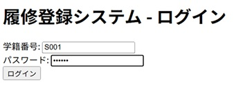
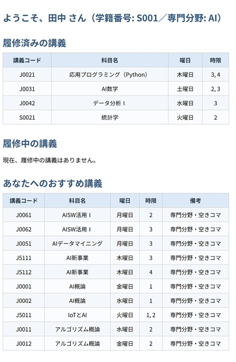
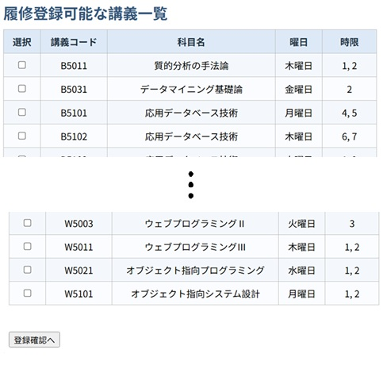
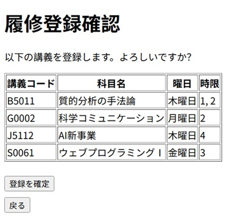
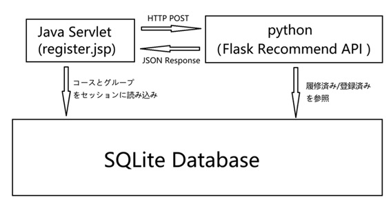

# 推薦機能付き履修管理システム

履修登録機能に加え、学生ごとの専攻分野や履修状況に基づいた講義推薦機能を備えた Web アプリケーションです。  
履修管理は Java（JSP/Servlet）、推薦機能は Python（Flask API）で構築され、機能を分離した構成となっています。

---

## 主な機能

### 履修管理機能（Java Webアプリ）
- ログイン／ログアウト
- 履修登録・履修解除
- 履修中／履修済科目の確認
- 前提科目チェック
- 時間割重複チェック

### 推薦機能（Python API）
- 専攻分野タグに基づく科目推薦
- 履修済・履修中科目の除外
- 前提科目未履修科目の除外
- 空きコマを考慮した講義推薦

---

## 画面イメージ

| 画面 | 例 |
|------|------|
| ログイン画面 |  |
| 履修登録画面1 |  |
| 履修登録画面2 |  |
| 登録確認画面 |  |

---

## システム構成
  

### 使用技術

| 分類 | 技術 |
|------|--------|
| フロントエンド | JSP, JSTL, HTML |
| サーバーサイド | Java Servlet, JPA |
| 推薦API | Python, Flask, Pandas |
| データベース | SQLite |
| 通信方式 | REST API（JSON） |

---

## API 概要

| 項目 | 内容 |
|------|--------|
| メソッド | POST |
| エンドポイント | /recommend |
| リクエスト(例) | {"student_id": "S001"} |
| レスポンス(例) | 推薦講義一覧（JSON） |

### 請求例

- 請求：
    curl -X POST -H "Content-Type: application/json"
    -d "{"student_id": "S001"}"
    http://localhost:5000/recommend
  
- 返し：
    {
      "recommended_courses": [
        { "class_code": "AI101", "name": "AI基礎", "priority": "high" },
        { "class_code": "DB201", "name": "データベース応用", "priority": "mid" }
      ]
    }

# ライセンス
本プロジェクトは教育目的で作成されたものです。
